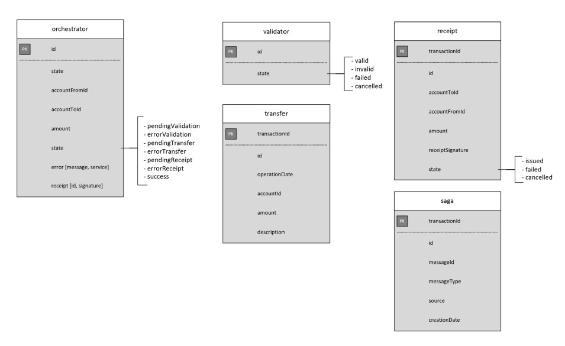
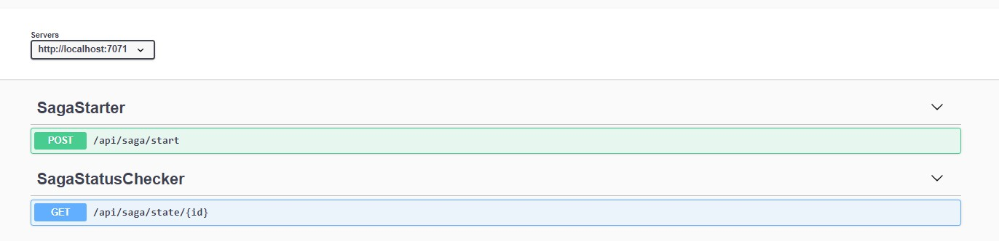
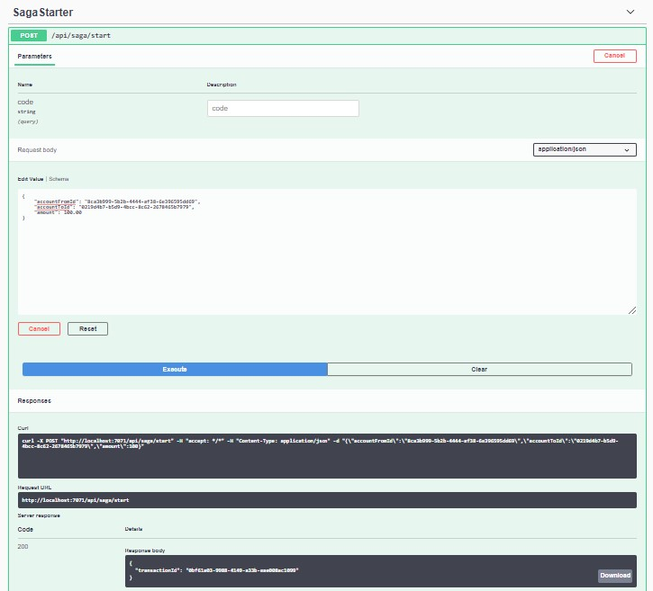

# Orchestration-based Saga on Serverless

Contoso Bank is building a new payment platform leveraging the development of microservices to rapidly offer new features in the market, where legacy and new applications coexist. Operations are now distributed across applications and databases, and Contoso needs a new architecture and implementation design to ensure data consistency on financial transactions.

The traditional [ACID](https://en.wikipedia.org/wiki/ACID) approach is not suited anymore for Contoso Bank as the data of operations are now spanned into isolated databases. Instead of ACID transactions, a [Saga](https://www.cs.cornell.edu/andru/cs711/2002fa/reading/sagas.pdf) addresses the challenge by coordinating a workflow through a message-driven sequence of local transactions to ensure data consistency.

## About the solution

The solution simulates a money transfer scenario, where an amount is transferred between bank accounts through credit/debit operations and an operation receipt is generated for the requester. It is a Saga pattern implementation reference through an orchestration approach in a serverless architecture on Azure. The solution leverages [Azure Functions](https://docs.microsoft.com/en-us/azure/azure-functions/functions-overview) for the implementation of Saga participants, [Azure Durable Functions](https://docs.microsoft.com/en-us/azure/azure-functions/durable/durable-functions-overview?tabs=csharp) for the implementation of the Saga orchestrator, [Azure Event Hubs](https://docs.microsoft.com/en-us/azure/event-hubs/event-hubs-about) as the data streaming platform and [Azure Cosmos DB](https://docs.microsoft.com/en-us/azure/cosmos-db/introduction) as the database service.

The implementation reference addresses the following challenges and concerns from Contoso Bank:

* **Developer experience:** A solution that allows developers focus only on the business logic of the Saga participants and simplify the implementation of stateful workflows on the Saga orchestrator. The proposed solution leverages the Azure Functions programming model, reducing the overhead on state management, checkpointing (mechanism that updates the offset of a messaging partition when a consumer service processes a message) and restarts in case of failures.
  
* **Resiliency:** A solution capable of handling a set of potential transient failures (e.g. operation retries on databases and message streaming platforms, timeout handling). The proposed solution applies a set of design patterns (e.g. Retry and Circuit Breaker) on operations with Event Hubs and Cosmos DB, as well as timeout handling on the production of *commands* and *events*.

* **Idempotency:** A solution where each Saga participant can execute multiple times and provide the same result to reduce side effects, as well as to ensure data consistency. The proposed solution relies on validations on Cosmos DB for idempotency, making sure there is no duplication on the transaction state and no duplication on the creation of *events*.
  
* **Observability:** A solution that is capable of monitoring and tracking the Saga workflow states per transaction. The proposed solution leverages Cosmos DB collections that allows the track of the workflow by applying a single query.

## Potential use cases

These other uses cases have similar design patterns:

* Settlement transactions
* Order services (e.g. e-commerce, food delivery, flight/hotel/taxi booking)

## Architecture


### Components

* **Saga Client:** A Web API implemented as an [Azure Durable Functions](https://docs.microsoft.com/en-us/azure/azure-functions/durable/durable-functions-overview?tabs=csharp) with [HTTP trigger binding](https://docs.microsoft.com/en-us/azure/azure-functions/functions-bindings-http-webhook-trigger?tabs=csharp) that receives HTTP requests to start new transactions. For each request, it generates a random transaction ID, starts a new Saga orchestrator instance and provides the transaction ID as part of the HTTP response.
  
* **Saga Orchestrator:** Long-running [Durable Orchestrator](https://docs.microsoft.com/en-us/azure/azure-functions/durable/durable-functions-orchestrations?tabs=csharp) that coordinates the transaction workflow by producing *commands* to Event Hubs and waiting for *events* from Saga participants.
  
* **Saga Orchestrator Activity:** [Activity function](https://docs.microsoft.com/en-us/azure/azure-functions/durable/durable-functions-types-features-overview#activity-functions) with [Cosmos DB binding](https://docs.microsoft.com/en-us/azure/azure-functions/functions-bindings-cosmosdb-v2) that persists the Saga state (*Pending*, *Success* and *Failed*) to Cosmos DB.

* **Command Producer Activity:** [Activity function](https://docs.microsoft.com/en-us/azure/azure-functions/durable/durable-functions-types-features-overview#activity-functions) with [Event Hubs binding](https://docs.microsoft.com/en-us/azure/azure-functions/functions-bindings-event-hubs) that produces *commands* created by the orchestration to Event Hubs.
  
* **Validator:** Saga participant implemented as an Azure Function with [Event Hubs trigger](https://docs.microsoft.com/en-us/azure/azure-functions/functions-bindings-event-hubs-trigger?tabs=csharp) and [Cosmos DB binding](https://docs.microsoft.com/en-us/azure/azure-functions/functions-bindings-cosmosdb-v2) that simulates a set of bank accounts validation before proceeding to money transfer between accounts (e.g. checking if both accounts exist, if accounts have sufficient balance, etc.). The resulted event (e.g *InvalidAccountEvent*) is produced on `Saga Reply` Event Hubs and persisted on Cosmos DB.

* **Transfer:** Saga participant implemented as an Azure Functions with [Event Hubs trigger](https://docs.microsoft.com/en-us/azure/azure-functions/functions-bindings-event-hubs-trigger?tabs=csharp) and [Cosmos DB binding](https://docs.microsoft.com/en-us/azure/azure-functions/functions-bindings-cosmosdb-v2) that simulates credit and debit operations on bank accounts. The resulted state (e.g. *TransferSucceededEvent*) is produced as on `Saga Reply` Event Hubs and persisted on Cosmos DB.

* **Receipt:** Saga participant implemented as an Azure Function with [Event Hubs trigger](https://docs.microsoft.com/en-us/azure/azure-functions/functions-bindings-event-hubs-trigger?tabs=csharp) and [Cosmos DB binding](https://docs.microsoft.com/en-us/azure/azure-functions/functions-bindings-cosmosdb-v2) that generates a receipt ID for the issuer. The resulted state (e.g. *ReceiptIssuedEvent*) is produced on `Saga Reply` Event Hubs and persisted on Cosmos DB.

* **Saga Event Processor:** [Azure Durable Functions](https://docs.microsoft.com/en-us/azure/azure-functions/durable/durable-functions-overview?tabs=csharp) with [Cosmos DB binding](https://docs.microsoft.com/en-us/azure/azure-functions/functions-bindings-cosmosdb-v2) and [Event Hubs trigger](https://docs.microsoft.com/en-us/azure/azure-functions/functions-bindings-event-hubs-trigger?tabs=csharp) that consumes all *events* produced by Saga participants, raises [external events](https://docs.microsoft.com/en-us/azure/azure-functions/durable/durable-functions-external-events?tabs=csharp) for orchestrator instances and persists the events on Cosmos DB.

* **Saga Status Checker:** [Azure Functions HTTP trigger](https://docs.microsoft.com/en-us/azure/azure-functions/functions-bindings-http-webhook-trigger?tabs=csharp) that provides a schema as part of the HTTP response with the saga status (e.g. *Pending*, *Finished* and *Failed*) and the saga orchestrator runtime status (e.g. *Running* and *Completed*).

### Successful Workflow


1. User sends an HTTP POST request with the expected payload to `Saga Client` to start a new transaction.

2. `Saga Client` generates a new `transaction ID`, starts a new instance of the orchestrator (assigning the `transaction ID` as the orchestrator `instance ID`) and provides the transaction ID as part of the HTTP POST response, allowing the requester to pool the saga status through the `Saga Status Checker` service.
  
3. `Saga Orchestrator` calls the `Saga Orchestrator Activity` to persist the initial Saga state as `PENDING` on Cosmos DB.

4. `Saga Orchestrator` calls the `Command Producer Activity` to produce a new *command* to Event Hubs to validate bank accounts. In the meantime, it waits for an external event that tells the result of the validation to move to the next step of the workflow.

5. `Validator` consumes the *command* generated by the orchestrator through Event Hubs, simulates a task that validates bank accounts, produces a new successful *event* to `Saga Reply` Event Hubs and persists the service data on Cosmos DB.

6. `Saga Event Processor` consumes the *event* generated by the `Validator`, persists the event data on Cosmos DB and raises an external event to `Saga Orchestrator` that contains the event name.

7. `Saga Orchestrator` receives the external event response and calls the `Command Producer Activity` to produce a new *command* to Event Hubs and starts the transfer process. In the meantime, it waits for an external event that tells the result of the transfer to move to the next step of the workflow.

8. `Transfer` consumes the *command* generated by the orchestrator through Event Hubs, simulates credit and debit operations on both bank accounts, produces a new successful *event* to `Saga Reply` Event Hubs and persists the service data on Cosmos DB.

9. `Saga Event Processor` consumes the *event* generated by the `Transfer`, persists the event data on Cosmos DB and raises an external event to `Saga Orchestrator` that contains the event name.

10. `Saga Orchestrator` receives the external event response and calls the `Command Producer Activity` to produce a new *command* to Event Hubs to create the transaction receipt. In the meantime, it waits for an external event that tells the result of the receipt generation process to finish the Saga.

11. `Receipt` consumes the *command* generated by the orchestrator through Event Hubs, generates a random receipt ID, produces a new successful *event* to `Saga Reply Event Hub` and persists the service data on Cosmos DB.

12. `Saga Event Processor` consumes the *event* generated by the `Receipt`, persists the event data on Cosmos DB and raises an external event to `Saga Orchestrator` that contains the event name.

13. `Saga Orchestrator` receives the external event response and calls the `Saga Orchestrator Activity` to update the Saga state to `SUCCESS` on Cosmos DB.

> Note: The requester can check the saga status and the orchestrator runtime status anytime by the `Saga Status Checker` through an HTTP GET request.

### Compensation Workflow


1. User sends an HTTP POST request with the expected payload to `Saga Client` to start a new transaction.

2. `Saga Client` generates a new `transaction ID`, starts a new instance of the orchestrator (assigning the `transaction ID` as the orchestrator `instance ID`) and provides the transaction ID as part of the HTTP POST response, allowing the user to query the status of the saga and the orchestrator runtime.

3. `Saga Orchestrator` calls the `Saga Orchestrator Activity` to persist the initial Saga state as `PENDING` on Cosmos DB.

4. `Saga Orchestrator` calls the `Command Producer Activity` to produce a new *command* to Event Hubs to validate bank accounts. In the meantime, it waits for an external event that tells the result of the validation to move to the next step of the workflow.

5. `Validator` consumes the *command* generated by the orchestrator through Event Hubs, simulates a task that validates bank accounts, produces a new successful *event* to `Saga Reply` Event Hubs and persists the service data on Cosmos DB.

6. `Saga Event Processor` consumes the *event* generated by the `Validator`, persists the event data on Cosmos DB and raises an external event to `Saga Orchestrator` with the event name.

7. `Saga Orchestrator` receives the external event response and calls the `Command Producer Activity` to produce a new *command* to Event Hubs and starts the transfer process. In the meantime, it waits for an external event that tells the result of the transfer to move to the next step of the workflow.

8. `Transfer` consumes the *command* generated by the orchestrator through Event Hubs, simulates credit and debit operations on both bank accounts, produces a new successful *event* to `Saga Reply` Event Hubs and persists the service data on Cosmos DB.

9. `Saga Event Processor` consumes the *event* generated by the `Transfer`, persists the event data on Cosmos DB and raises an external event to `Saga Orchestrator` with the event name.

10. `Saga Orchestrator` receives the external event response and calls the `Command Producer Activity` to produce a new *command* to Event Hubs to create the transaction receipt. In the meantime, it waits for an external event that tells the result of the receipt generation process to finish the Saga.

11. `Receipt` consumes the *command* generated by the orchestrator through Event Hubs, an error occurs on generating the receipt ID, the `FAILED` task result is persisted on Cosmos DB and a new failed *event* is produced to `Saga Reply Event Hub`.

12. `Saga Event Processor` consumes the *event* generated by the `Receipt`, persists the event data on Cosmos DB and raises an external event to `Saga Orchestrator` with the `FAILED` state.

13. `Saga Orchestrator` receives the external event response and calls the `Command Producer Activity` to produce a new *compensation command* to Event Hubs to *compensate* the transfer process. In the meantime, it waits for an external event that tells the result of the compensating transaction to finish the Saga.

14. `Transfer` consumes the *compensation command* generated by the orchestrator through Event Hubs, undo the credit and debit operations on both bank accounts, produces a new *compensation event* to `Saga Reply` Event Hubs and persists the service data on Cosmos DB.

15. `Saga Event Processor` consumes the *compensation event* generated by the `Transfer`, persists the event data on Cosmos DB and raises an external event to `Saga Orchestrator` with the event name.

16. `Saga Orchestrator` receives the external event response and calls the `Saga Orchestrator Activity` to update the Saga state to `CANCELLED` on Cosmos DB.
  
### Additional patterns applied

* [Async HTTP APIs](https://docs.microsoft.com/en-us/azure/azure-functions/durable/durable-functions-overview?tabs=csharp#async-http): Designing an API that provides s synchronous HTTP response in the context of Saga is not best approach, as Saga is designed for long-lived transactions (i.e. long-running operations). The Async HTTP API pattern is used to address this problem, where `Saga Client` triggers the long-running action and redirects the client to a status endpoint that allows the client to poll it to know when the transaction is finished.

* [Retry](https://docs.microsoft.com/en-us/azure/architecture/patterns/retry): Pattern used on producing messages to Event Hubs and [activities](https://docs.microsoft.com/en-us/azure/azure-functions/durable/durable-functions-types-features-overview#activity-functions) calls from the orchestrator.
  
* [Circuit Breaker](https://docs.microsoft.com/en-us/azure/architecture/patterns/circuit-breaker): Pattern integrated with Retry on producing messages to Event Hubs.

* [Database-per-microservice](https://docs.microsoft.com/en-us/dotnet/architecture/cloud-native/database-per-microservice): Pattern used to ensure that each Saga participant manages your own data decoupled from other participants.

### Alternatives

The Saga pattern can also be implemented through a [choreography](https://chrisrichardson.net/post/sagas/2019/08/04/developing-sagas-part-2.html) approach. In choreography, saga participants exchange *commands* and *events* without an orchestrator that coordinates the workflow. Both orchestration and choreography approaches have benefits and drawbacks:

| Saga | Benefits                   | Drawbacks                  |
| ------------- | -------------------------- | -------------------------- |
| Orchestration | <ol><li>Suited for complex Saga workflows that require large number of saga participants or new participants added over time</li><li>Does not introduce cyclic dependencies as the orchestrator depends on the saga participants but not vice versa</li><li>Less coupling, as saga participants don't need to know about commands that need to be produced for other participants</li><li>Clear separation of concerns that simplifies the business logic</li></ol> | <ol><li>Additional design complexity that requires an implementation of a coordination logic</li><li>Additional point of failure as it manages the complete workflow</li></ol> |
| Choreography  | <ol><li>Suited for simple Saga workflows that require few saga participants as there is no need to designing an implementation of a coordination logic</li><li>Does not require additional service implementation and maintenance</li><li>Does not introduce a single point of failure since the responsibilities are distributed across the saga participants</li></ol>| <ol><li>Workflow can become confusing while adding new steps, as it is difficult to track which saga participants listen to which commands</li><li>Potential risk of adding cyclic dependency between saga participants as they have to consume to one another's commands</li><li>Integration testing tends to be hard as all services should be running in order to simulate a transaction</li></ol> |

## Considerations

### Data modeling

Modeling data on Cosmos DB or any other NoSQL service requires assuming some benefits and drawbacks depending on the strategy applied. 

The proposed solution is leveraging the [Database-per-microservice](https://docs.microsoft.com/en-us/dotnet/architecture/cloud-native/database-per-microservice) pattern, where each Saga participant manages your own data on isolated databases for decoupling. It implies that the data of a Saga participant cannot be accessed directly from other Saga participants neither the orchestrator.


The solution, in the Cosmos DB perspective, is designed as *collection-per-microservice*. This brings some benefits and drawbacks:

| Data approach           | Benefits | Tradeoffs |
|-------------------------|----------|-----------|
| Collection-per-microservice | <ol><li>Domain data is encapsulated within the saga participant</li><li>Data schema can evolve without directly impacting other saga participants</li><li>Each saga participant data store can independently scale</li><li>A data store failure in one saga participant won't directly impact other participants</li></ol>   | <ol><li>Creation of queries that join data in multiple collections has potential to become complex and impact performance exponentially as the data volume increase over time</li><li>Cosmos DB has a limitation on Request Units (RUs) that impacts the max number of collections (more info [here](https://docs.microsoft.com/en-us/azure/cosmos-db/concepts-limits)) so depending on the number of saga participants it can be a limitation</li><li>More collections means increase of costs, as it will demand more RUs </li></ol>      |

To address the tradeoff related to the creation of complex queries, the solution is leveraging the [denormalization](https://docs.microsoft.com/en-us/azure/cosmos-db/how-to-model-partition-example#v2-introducing-denormalization-to-optimize-read-queries) approach to optimize read queries by creating an additional collection that consolidates the state results of all Saga participants. This approach drastically reduces complexity and improves performance for **observability** purposes.



Another approach for data modeling is defining a single collection shared across Saga participants. It will drastically reduce costs, but you will not have the decoupling benefits described above.

To decide how to provision throughput, containers and databases in Cosmos Db, we have to consider that Cosmos Db can provision throughput at two granularities:

* Containers: The throughput provisioned is exclusively for the container and it will consume all the throughput that is made available. Considering the internal distribution, the container distributes the throughput among its physical and logical partitions, and it cannot be specified the throughput for logical partitions. Because one or more logical partitions of a container are hosted by a physical partition, the physical partitions belong exclusively to the container and support the throughput provisioned on the container.
If the workload running on a logical partition consumes more than the throughput that was allocated to that logical partition, your operations get rate-limited. When rate-limiting occurs, you can either increase the provisioned throughput for the entire container or retry the operations.

* Databases: The throughput is shared across all containers in the database. It guarantees that receives the provisioned throughput for that database all the time. Because all containers within the database share the provisioned throughput, Azure Cosmos DB does not provide any predictable throughput dedication for any particular container in that database. The portion of the throughput that a specific container can receive depends on the number of containers, the choice of partition keys and the workload distribution across the logical partitions on the containers.
It is important to note that inside a Cosmos Db database, you can provision at most 25 containers that are grouped into a partition set and the database throughput is shared across these 25 containers. For every new container created beyond 25 containers, it creates a new partition set and the database throughput is split between the new partition sets. This approach reduces the throughput for a single partition set. A good approach is to keep 25 containers for a single database.

### Database Partitioning

This is the list of requests the proposed solution will have to expose:

* **[C]** Create/edit a Saga participant state per transaction ID
* **[Q1]** Retrieve the saga state per transaction ID
* **[Q2]** List each Saga participant state associated with a transaction ID

For the **[C]** item, a request is straightforward to implement as we just create or update an item on each Saga participant collection. The requests are nicely spread across all partitions with the `transaction ID` defined as the primary and partition key.

For the **[Q1]** item, retrieving a saga state is done by reading the corresponding `transaction ID` from the `transaction` collection. The requests are nicely spread across all partitions with the `transaction ID` defined as the primary and partition key.

For the **[Q2]** item, a request is straightforward to implement as all saga participant states are consolidated in the `saga` collection. The requests are nicely spread across all partitions with the `ID` as the primary key and `transaction ID` defined as the partition key.

For more information about strategies for data modeling and data partitioning, check the [How to model and partition data on Azure Cosmos DB using a real-world example](https://docs.microsoft.com/en-us/azure/cosmos-db/how-to-model-partition-example#identify-the-main-access-**patterns**) article.

### Message Broker Partitioning

Event Hubs provide message streaming through a partitioned consumer pattern in which each consumer only reads a specific subset, or partition, of the message stream. A partition is an ordered sequence of events that is held in an event hub. As newer events arrive, they are added to the end of this sequence. A partition can be thought of as a "commit log". 

The `transaction ID` field was chosen to guarantee that all messages related to a given transaction will be processed in sequence by each service. Since each service has its own dedicated inbox Event Hub, we didn't need to create different consumer groups for each service.

For additional details, please check [Event Hubs documentation](https://docs.microsoft.com/en-us/azure/event-hubs/event-hubs-features#partitions).

### Scalability

Each Saga participant instance is backed by a single [Event Processor Host (EPH)](https://docs.microsoft.com/en-us/azure/event-hubs/event-hubs-event-processor-host); an intelligent consumer agent that simplifies the management of checkpointing, leasing, and parallel event readers. The [Event Hubs trigger](https://docs.microsoft.com/en-us/azure/azure-functions/functions-bindings-event-hubs-trigger?tabs=csharp) ensures that only one EPH instance can get a lease on a given partition. For a better understanding, consider the following scenario of an Event Hub for a Saga participant:

* `N` partitions
* `W` commands distributed evenly across all partitions = `W/N` messages in each partition

Only one instance of the Saga participant function is created when the function starts; consider as `SagaParticipant-0` instance. The `SagaParticipant-0` has a single instance of the EPH that holds a lease on all `N` partitions, reading commands from partitions 0-(N-1). Then the following scenarios can occur:

| Scenario                | Description |
|-------------------------|-------------|
| No need for new Saga participant instance | `SagaParticipant-0` is able to process all `W` commands before the Functions scaling logic takes effect.     |
| A new Saga participant instance is added | If the Functions scaling logic determines that `SagaParticipant-0` has more messages than it can process, it creates a new function app instance (`SagaParticipant-1`) and it associates a new instance of the EPH. As the underlying Event Hubs detects that a new host instance is trying to read messages, it distributes the load across its partitions. For example, partitions 0-4 may be assigned to `SagaParticipant-0` and partitions 5-9 to `SagaParticipant-1`.|
| More Saga participant instances are added | If the Functions scaling logic determines that both `SagaParticipant-0` and `SagaParticipant-1` have more messages than they can process, new `SagaParticipant-Y` instances are created until reaching the state where `Y` is greater than `N` Event Hub partitions. In this scaling scenario, Event Hubs again load balances the partitions across the instances `SagaParticipant-0` to `SagaParticipant-(N-1)`.|

> Note: The same scaling mechanism for saga participants is used  for `Saga Event Processor` service, that also leverages the Event Hubs trigger binding.

The `Saga Orchestrator`, `Command Producer Activity` and `Saga Orchestrator Activity` functions are triggered by an internal queues in Azure Functions, known as **control queues**, that contain a variety of orchestration lifecycle message types. Orchestrator and activity instances are stateful singletons, so messages are load-balanced across the control queues instead of using a competing consumer model to distribute load across VMs. The Durable Functions task implements a random exponential back-off algorithm to reduce the effect of idle-queue polling on storage transaction costs. When a message is found, the runtime immediately checks for another message; when no message is found, it waits for a period of time before trying again. After subsequent failed attempts to get a queue message, the wait time continues to increase until it reaches the maximum wait time, which defaults to 30 seconds. For more info about the scaling mechanism, check the [Performance and scale in Durable Functions (Azure Functions)](https://docs.microsoft.com/en-us/azure/azure-functions/durable/durable-functions-perf-and-scale) documentation.

### Availability

* Azure Functions availability will vary according to the hosting plan decision: [Dedicated (App Service)](https://docs.microsoft.com/en-us/azure/azure-functions/functions-scale#app-service-plan), [Consumption](https://docs.microsoft.com/en-us/azure/azure-functions/functions-scale#consumption-plan) and [Premium](https://docs.microsoft.com/en-us/azure/azure-functions/functions-scale#premium-plan) plans.
* For Event Hubs, see the [Availability and consistency in Event Hubs](https://docs.microsoft.com/en-us/azure/event-hubs/event-hubs-availability-and-consistency?tabs=latest) documentation.

### Security

* The solution leverages the default app settings mechanism provided by Azure Functions. To increase security on secrets management, it's recommended the use of [Azure Key Vault](https://docs.microsoft.com/en-us/azure/key-vault/basic-concepts). This topic shows you how to work with secrets from Azure Key Vault in your App Service or Azure Functions application without requiring any code changes: [Use Key Vault references for App Service and Azure Functions](https://docs.microsoft.com/en-us/azure/app-service/app-service-key-vault-references).

* The HTTP endpoints provided by `Saga Client` and `Saga Status Checker` functions must have a set of security improvements for production scenarios. To fully secure your function endpoints in production, you should consider implementing one of the following function app-level security options explained in the [Secure an HTTP endpoint in production](https://docs.microsoft.com/en-us/azure/azure-functions/functions-bindings-http-webhook-trigger?tabs=csharp#secure-an-http-endpoint-in-production) documentation.

* Encryption at rest is applied automatically on new Cosmos DB databases. For more information about the security mechanisms applied on Cosmos DB, see the [Security in Azure Cosmos DB - overview](https://docs.microsoft.com/en-us/azure/cosmos-db/database-security) documentation.

* The solution does not provide role-based access control (RBAC) for fine-grained control over a client's access to resources on Event Hubs. It's recommended defining RBAC for production scenarios, see the [Authorize access to Azure Event Hubs](https://docs.microsoft.com/en-us/azure/event-hubs/authorize-access-event-hubs) documentation.

### Limitations

* See the [Azure Functions service limits](https://docs.microsoft.com/en-us/azure/azure-functions/functions-scale#service-limits) for scaling limitations on different billing models.
* See the [Cosmos DB storage and throughput](https://docs.microsoft.com/en-us/azure/cosmos-db/concepts-limits) for service quotas.
* See the [Event Hubs quotas and limits](https://docs.microsoft.com/en-us/azure/event-hubs/event-hubs-quotas) per service tier.

## Maturity Level

These are the top skills required for Solution Architects and Developer Leads that will reuse the proposed solution or parts of the implementation as reference:

* **Architectures:** Microservices, Event-driven and Serverless
* **Design Patterns:** Saga, Database-per-microservice, Async HTTP API, Retry, Circuit Breaker
* **Azure services:** Azure Functions (including Event Hubs + Cosmos DB bindings and Durable Functions extension), Event Hubs, Cosmos DB, Azure Storage
* **Programming Language:** C#
* **Additional concepts:** Infrastructure as Code, RESTful APIs, idempotency
  
## Repository Structure (TODO)

Outline the file contents of the repository. It helps users navigate the codebase, build configuration and any related assets.

| File/folder       | Description                                |
|-------------------|--------------------------------------------|
| `src`             | Sample source code.                        |
| `.gitignore`      | Define what to ignore at commit time.      |
| `CHANGELOG.md`    | List of changes to the sample.             |
| `CONTRIBUTING.md` | Guidelines for contributing to the sample. |
| `README.md`       | This README file.                          |
| `LICENSE`         | The license for the sample.                |

The `src` folder contains a set of .NET Core solutions:

| Project                | Description  |
|-------------------------|--------|
| Saga.Common | Solution that contains a set of reusable abstractions, models, *commands* and *events* objects and utilities |
| Saga.Common.Tests | Solution that contains all unit tests for common utilities and processors |
| Saga.Functions | Solution that contains all Azure Functions |
| Saga.Functions.Tests | Solution that contains all Azure Functions unit tests |
| Saga.Orchestration | Solution that contains domain models and the coordination logic for the Saga Orchestrator |
| Saga.Orchestration.Tests | Solution that contains unit tests for the Saga Orchestrator |
| Saga.Participants | Solution that contains domain models and business logic of all Saga participants |
| Saga.Participants.Tests | Solution that contains unit tests of all Saga participants |

## Prerequisites

* An Azure account with an active subscription. [Create an account for free](https://azure.microsoft.com/en-us/free/?ref=microsoft.com&utm_source=microsoft.com&utm_medium=docs&utm_campaign=visualstudio).
* [Azure CLI](https://docs.microsoft.com/en-us/cli/azure/install-azure-cli?view=azure-cli-latest)
* [Terraform](https://learn.hashicorp.com/terraform/azure/install_az) 0.2.6 or later
* [Azure Functions Core Tools](https://docs.microsoft.com/en-us/azure/azure-functions/functions-run-local?tabs=linux%2Ccsharp%2Cbash) v3.0 or later
* [.NET Core](https://dotnet.microsoft.com/download) 3.1 or later

If [Visual Studio Code](https://code.visualstudio.com/) is your platform preference for development:

* [C# extension](https://marketplace.visualstudio.com/items?itemName=ms-dotnettools.csharp)
* [Azure Functions extension](https://marketplace.visualstudio.com/items?itemName=ms-azuretools.vscode-azurefunctions)

If [Visual Studio](https://azure.microsoft.com/en-us/downloads/) is your platform preference for development:

* Visual Studio 2019 with [Azure development](https://docs.microsoft.com/en-us/azure/azure-functions/functions-create-your-first-function-visual-studio#prerequisites) workload

## Getting Started

### 1. Creating the application settings

The solution requires a set of environment variables to be configured on `Saga.Functions` solution for running the project locally. Follow the [Configuring the Azure Functions Application Settings](./docs/functions-app-settings.md) instructions to create a `local.settings.json`. Make sure the settings are configured before proceeding to the next step.

### 2. Running unit tests

Run the following command on test projects:

```sh
dotnet test
```

### 3. Running the solution

For running the solution through command line, make sure you're on the `src/Saga.Functions` directory then run the following command:

```sh
func host start
```

The solution provides a Swagger UI on `http://localhost:<port>/api/swagger/ui`. 



You can start a new HTTP request on `/api/saga/start` route by providing the following json as part of the body content:

```json
{
    "accountFromId": "<random ID>",
    "accountToId": "<random ID>",
    "amount": 100.00
}
```

After executing the request, it's expected to receive the transaction ID as part of the HTTP response.



You can check the documents created on Cosmos DB. It is expected to have the following document structure on the `orchestrator` collection:

```json
{
  "accountFromId": "<random bank account ID>",
  "accountToId": "<random bank account ID>",
  "amount": 100,
  "id": "<random transaction ID>",
  "type": "Default",
  "state": "Success",
  ...
}
```

For observability, check the `saga` collection that contains all events processed by the orchestrator.  It is expected to have the following structure:

```json
{
  "transactionId": "<random transaction ID>",
  "source": "<Validator, Transfer or Receipt>",
  "messageType": "<event name>",
  "creationDate": "<event creation date>",
  ...
}
```

## Next Steps

* [Understanding the Saga Orchestrator](docs/saga-orchestrator.md)
* [Adding new Saga participants in a workflow](./docs/add-saga-participants.md)
* [Commands and Events Contracts](./docs/commands-events.md)

## Contributing

This project welcomes contributions and suggestions.  Most contributions require you to agree to a
Contributor License Agreement (CLA) declaring that you have the right to, and actually do, grant us
the rights to use your contribution. For details, visit https://cla.opensource.microsoft.com.

When you submit a pull request, a CLA bot will automatically determine whether you need to provide
a CLA and decorate the PR appropriately (e.g., status check, comment). Simply follow the instructions
provided by the bot. You will only need to do this once across all repos using our CLA.

This project has adopted the [Microsoft Open Source Code of Conduct](https://opensource.microsoft.com/codeofconduct/).
For more information see the [Code of Conduct FAQ](https://opensource.microsoft.com/codeofconduct/faq/) or
contact [opencode@microsoft.com](mailto:opencode@microsoft.com) with any additional questions or comments.
