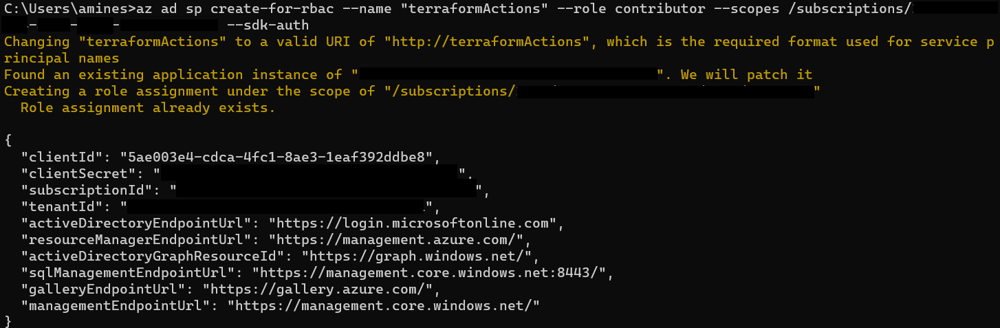
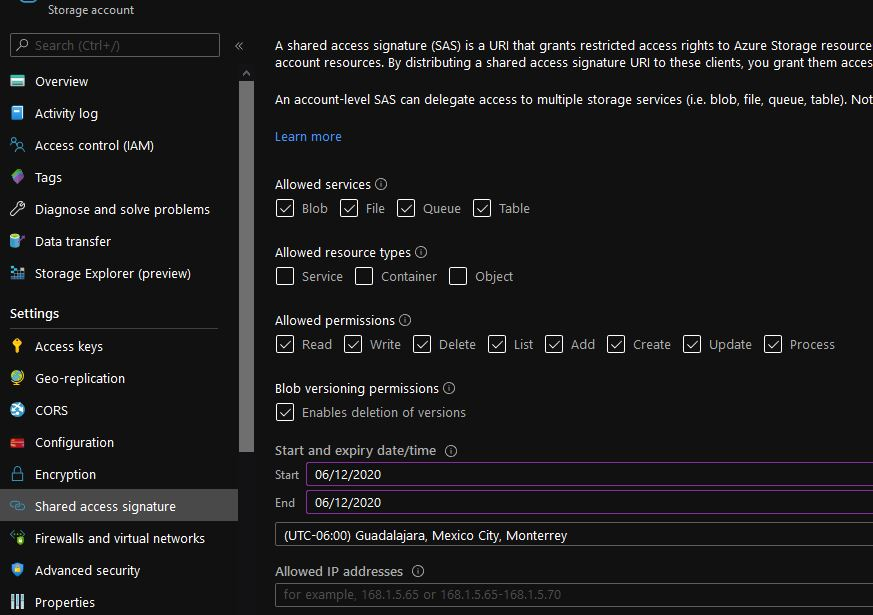
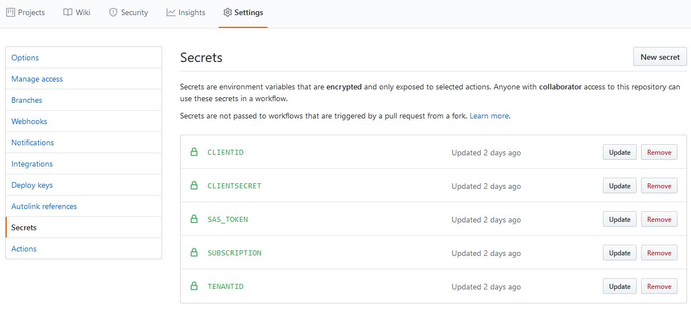
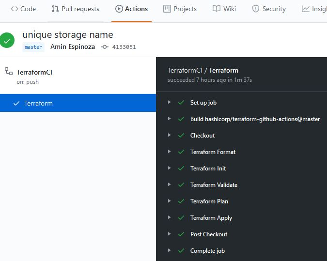

# Create Infrastructure as Code
This project is implemented using 3 main services in Azure: Functions, Event Hub and CosmosDB using Terraform to provision the required environment in Azure for this project.

The flow is triggered and controlled by a [Github Action](https://help.github.com/es/actions). The action contains a set of tasks that are organized logically to evaluate Terraform scripts and to provision the infrastructure on Azure.

## Environment Resources

The infrastructure provisioned by Terraform includes:

| Service | Description |
|---|---| 
| Resource Group | Contains all the resources for the solution |
| Event Hub | To ingest and distribute data to the functions. The script will create four event hubs - (`validator`, `receipt`, `transfer`, `saga-reply`)|
| Functions | Serverless compute services. This includes Durable functions |
| CosmosDB | multi-model database service for operational and analytics workloads. The script will create five collectiosn - `validator`, `receipt`, `orchestrator`, `transfer`, `saga`|

Prerequisites:

* [Azure CLI](https://docs.microsoft.com/en-us/cli/azure/install-azure-cli?view=azure-cli-latest)
* A pre existing Azure Storage Account
* A Service Principal - [Azure doc](https://docs.microsoft.com/en-us/cli/azure/create-an-azure-service-principal-azure-cli?view=azure-cli-latest) | [Terraform doc](https://www.terraform.io/docs/providers/azurerm/guides/service_principal_client_secret.html)

## IAC Folder structure

There are six Terraform (`.tf`) scripts to create this environment:

| Script    | Description |
|---|---|
| [main.tf](../iac/main.tf) | main file with the environment definition |
| [variables.tf](../iac/variables.tf) | variables used in the main script | 
| [backend.tf](../iac/backend.tf) | backend used by Terraform |
| [version.tf](../iac/version.tf)| minimun Terraform version required |
| [provider.tf](../iac/provider.tf)| required providers required by Terraform |
| [terraform.tfvars](../iac/terraform.tfvars)|the file with the required values to create the environment|

The only scripts that **must** need a change are `terraform.tfvars` as it is used to customize the infrastructure names and some of those names are required to be unique global identifiers and `backend.tf` to set the Azure Storage account values for preserving the state.

### 1. Create the Service Principal

1. By using Azure CLI, in case you need it, you need to create an Azure Service Principal

```bash
az ad sp create-for-rbac --name "myApp" --role contributor --scopes /subscriptions/your-subscription-id --sdk-auth
```



You'll need from here the **clientId**, **clientSecret**, **subscriptionId** and **tenantId**

### 2. Azure Storage SAS token

From an already created Azure Storage Account, you'll need access to create a new blob file for Terraform state persistance. To set this account in the **backend.tf** file.

In the portal, got to the Storage account and generate a **Shared access signature**.



Now that you already have these five values it's time to go to Github.

### 3. Generate Github Secrets

In the Github Settings tab, create five secrets with the following names.



After the creation of those secrets you'll need to push changes in the **master branch** making sure the changes are being reflected in the **iac folder** to let the corresponding Github Action be triggered. A succesful result will be demonstrated in the workflow of **TerraformCI/CD** action.




